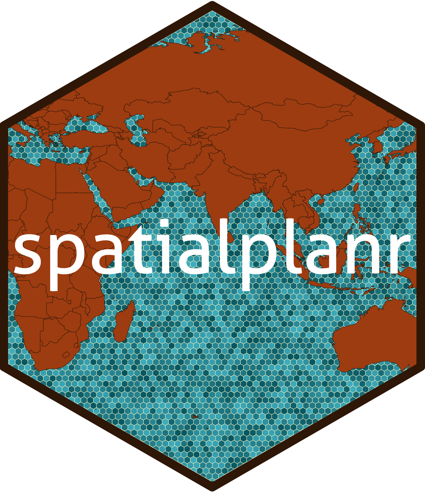

<!-- README.md is generated from README.Rmd. Please edit that file -->

# spatialplanr <a href='https://github.com/MathMarEcol/spatialplanr'></a>

<!-- badges: start -->

[](https://lifecycle.r-lib.org/articles/stages.html#experimental)
[](https://github.com/MathMarEcol/spatialplanr/actions/workflows/R-CMD-check.yaml)
[](https://app.codecov.io/gh/MathMarEcol/spatialplanr?branch=master)
[](https://github.com/MathMarEcol/spatialplanr/issues)
<!-- badges: end -->

## Overview

This repository is specific to the work of the [Mathematical Marine
Ecology Lab](https://mathmarecol.github.io) at the University of
Queensland. It is not intended to be used by anyone outside the MME Lab
without the permission of Professor Anthony Richardson.

This code has been written to simplify the process for running a
*prioritizr* analysis on a given region use the workflows and data of
the MME Lab. It is still a work in progress so feel free to submit pull
requests with new features and code improvements.

## Installation

Be aware that this package is in the very early stages of development.
Functions and documentation are not complete so installing at the moment
is at your own risk. If you are still interested, you can install the
development version from [GitHub](https://github.com/) with:

``` r
# install.packages("devtools")
devtools::install_github("https://github.com/MathMarEcol/spatialplanr")
```
